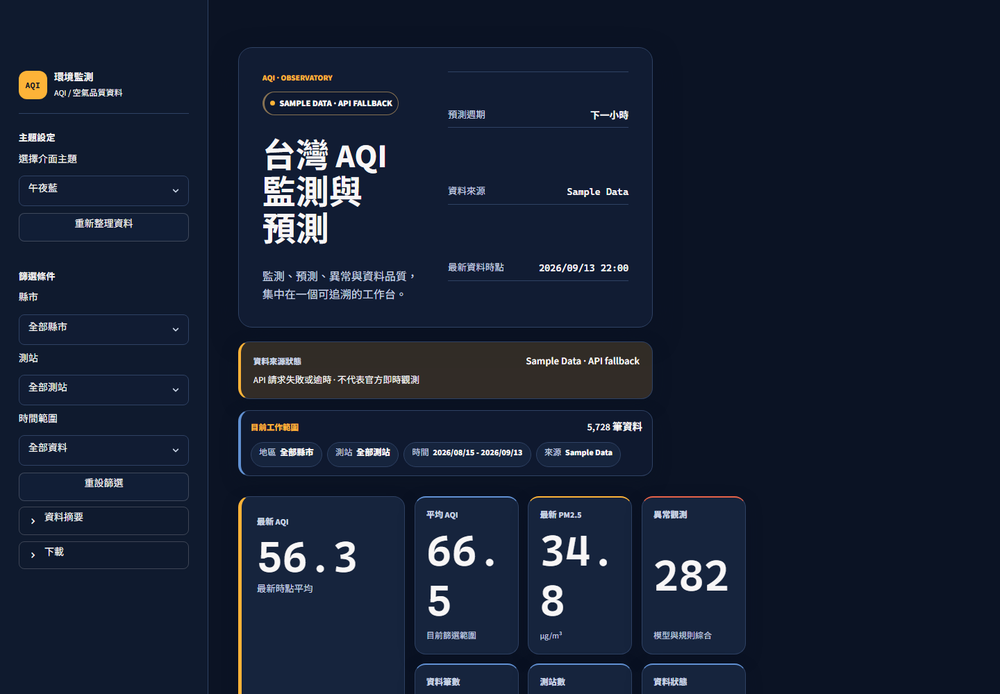
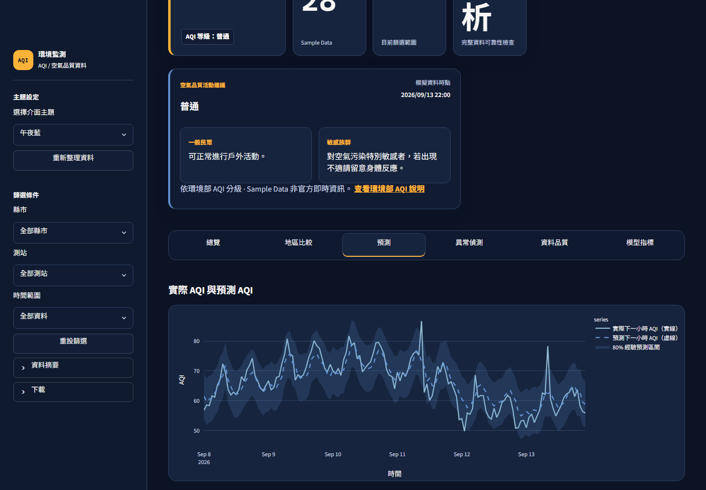
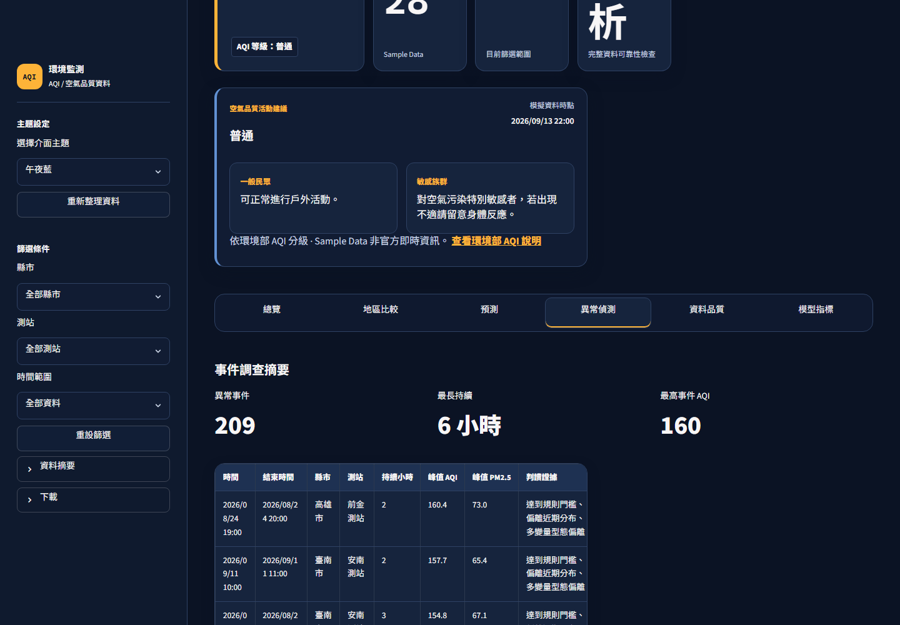

# Taiwan AQI Monitoring & Forecasting Dashboard

[](https://github.com/Lily09-project/aqi-anomaly-dashboard/actions/workflows/quality.yml)
[](https://github.com/Lily09-project/aqi-anomaly-dashboard/actions/workflows/security.yml)

以台灣測站資料打造的 AQI 監測、下一小時預測與異常調查工作台。介面支援桌面／行動裝置與深色／淺色主題。

> Sample Data 僅供重現與測試，不代表官方警報、醫療建議或污染來源判定。

## 介面預覽





## Highlights

- AQI／PM2.5 趨勢、地圖選站與地區比較。
- Moving Average、Linear Regression、Random Forest 的 next-hour forecast 與 chronological backtest。
- 80%／95% empirical intervals、coverage、區間寬度與跨級風險。
- Z-score、Isolation Forest 與事件合併的異常證據。
- 資料健康度、更新延遲、缺失值、測站可靠性與模型漂移摘要。
- API 失敗時提供清楚的 fallback／empty state，並支援 CSV、摘要與 reliability JSON 下載。

## Quick start

```powershell
git clone https://github.com/Lily09-project/aqi-anomaly-dashboard.git
cd aqi-anomaly-dashboard
py -3.12 -m venv .venv
.\.venv\Scripts\python.exe -m pip install -r requirements.txt
.\.venv\Scripts\python.exe run_all.py --mode sample
.\.venv\Scripts\python.exe -m streamlit run app.py
```

Windows 入口與驗證：

```powershell
.\run_project.bat
.\run_project.bat --validate
```

## Validation

```powershell
.\.venv\Scripts\python.exe -m pytest -q
.\.venv\Scripts\python.exe quality\run_acceptance.py release
```

## Data & security

API 參數只放在未提交的 `.env` 或部署平台 secrets；repository 不包含金鑰、cache 或本機產物。資料契約與部署方式見 [docs/data-contract.md](docs/data-contract.md) 及 [docs/deployment.md](docs/deployment.md)，安全政策見 [SECURITY.md](SECURITY.md)。
