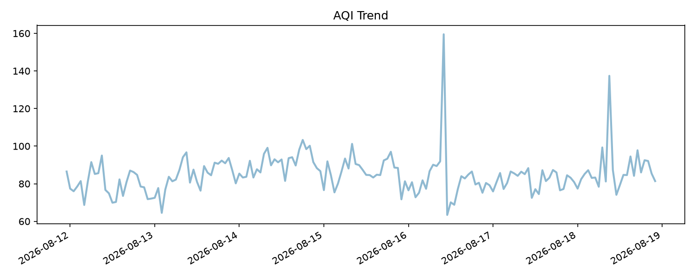
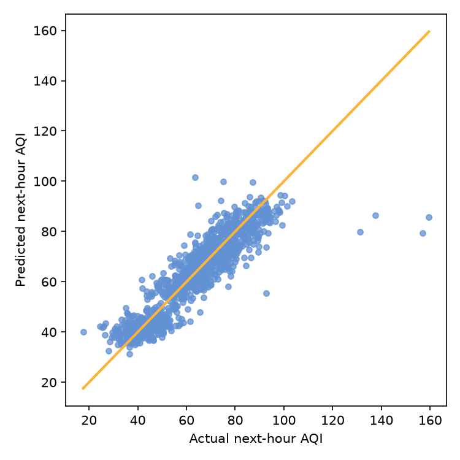
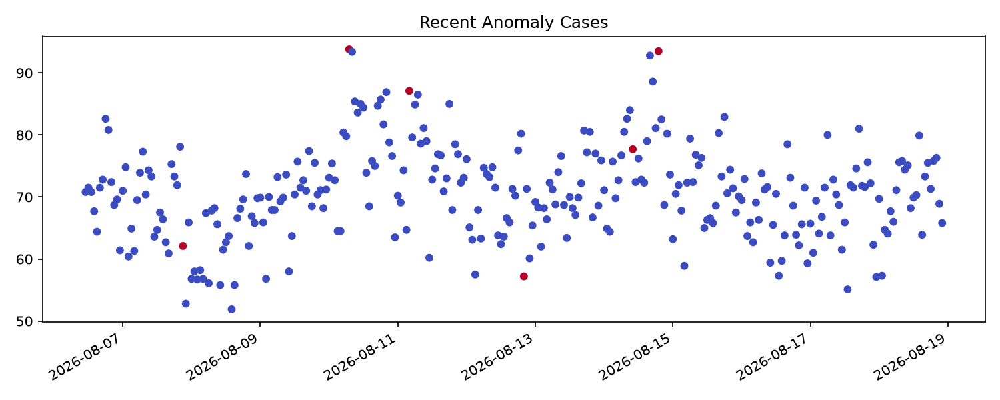

# Taiwan AQI Monitoring & Forecasting Dashboard

一個可重現、可檢查、可展示的台灣空氣品質資料產品。專案從資料取得與 Sample Data fallback 開始，經過資料清理、測站級時間序列特徵工程、下一小時 AQI 預測、異常事件偵測、模型評估與資料健康度分析，最後以繁體中文 Streamlit Dashboard 提供地圖選站、趨勢判讀、模型比較與事件調查。

這個專案的重點不是只展示一個模型分數，而是把模型結果整理成一個人可以檢查與追溯的監測工作流：

- 先用台灣地圖或縣市／測站篩選定位範圍。
- 再查看目前 AQI、PM2.5、近期變化與測站自己的歷史基準。
- 接著檢視下一小時預測、預測區間與可能跨越的 AQI 分級。
- 最後以異常證據、資料新鮮度與模型可靠性決定哪些測站值得優先調查。

> 重要聲明：Repository 中的 Sample Data 是模擬資料，只用於本地 Demo、測試與開發，不代表環境部官方即時監測資料。預測與異常結果不是官方警報、醫療建議、污染來源判定或個人行程建議。

## Project Snapshot

| 項目 | 說明 |
| --- | --- |
| 專案定位 | End-to-end data science / machine learning product |
| 使用情境 | 多測站 AQI 監測、下一小時趨勢判讀與異常事件初篩 |
| 前端 | Streamlit、Plotly、繁體中文 Dashboard |
| 預測模型 | Moving Average、Linear Regression、Random Forest |
| 異常方法 | Z-score baseline、Isolation Forest |
| 預測任務 | 使用同測站當下與過去資料預測下一小時 AQI |
| 評估方法 | Chronological split、rolling-origin backtest、final test |
| 可信度輸出 | 80% / 95% empirical forecast intervals |
| 可重現入口 | run_all.py、smoke test、pytest、Windows one-click launcher |
| 公開原則 | GitHub 只保留程式、設定範例、測試與文件，生成物由流程重新建立 |

快速入口：[部署指南](docs/deployment.md) · [操作檢查表](docs/operations-checklist.md) · [資料契約](docs/data-contract.md) · [中文面試講稿](docs/interview-guide.md)

## Actual Output Preview

以下圖片由本次 run_all.py --mode sample 實際產生，不是手工繪製的 mockup。圖片只包含公開分析結果，不包含 API token、原始 API 回應或模型檔。

  
  

  

執行完整流程後，Dashboard 會將同一批輸出載入到總覽、預測、異常偵測、資料品質與模型指標頁面。Sample Data 預設使用執行日往前推算的最近 30 天，因此重新執行時日期會隨當前日期更新。

## Why This Project Matters

### 從模型展示提升為判讀工作流

一般 AQI Demo 常見的做法是放一張趨勢圖與一個預測數字。本專案加入測站脈絡化判讀層：

- 以同測站、相同小時且早於目前時間的資料建立歷史基準。
- 同時呈現目前 AQI、PM2.5、近 6 小時變化、下一小時預測與異常訊號。
- 把異常拆成規則式標籤、Z-score 與 Isolation Forest 證據，而不是只輸出一個無法解釋的風險分數。
- 用台灣地圖選站，讓地區篩選同步影響趨勢、預測、異常與資料品質頁面。

這個系統提供的是人工檢視優先順序，不是官方警報。每一個判讀結果都可以回到原始欄位、計算規則或模型輸出追查。

### 同時呈現準確度與不確定性

預測頁除了 Actual vs Predicted，也會呈現：

- MAE、RMSE、R2。
- Moving Average、Linear Regression、Random Forest 比較。
- Rolling-origin backtest 結果。
- 80% / 95% 經驗預測區間。
- Final-test coverage 與平均區間寬度。
- 預測區間是否跨過 AQI 50、100、150、200、300 門檻。

預測區間使用 final test 之前的 rolling-origin out-of-fold 絕對殘差校準，final test 只用於最後報告，不反過來調整區間。這讓使用者可以分開理解「模型平均預測得準不準」與「這一次預測的不確定性有多大」。

### 先檢查資料新鮮度，再做測站比較

地區比較可以選擇 2 至 3 個測站，並排比較：

- 最新 AQI 與 AQI level。
- 下一小時預測與 80% 預測區間。
- 測站歷史基準。
- PM2.5 與最新觀測時間。
- 異常證據與資料新鮮度。

系統會先檢查測站之間的觀測時間差，排除相對最新測站落後超過 2 小時的比較結果，避免把不同時間點的數值直接當成同一時刻比較。

## Dashboard Capabilities

| 頁面 | 使用者可以做什麼 |
| --- | --- |
| 總覽 | 查看 AQI / PM2.5 趨勢、台灣測站地圖、測站脈絡優先排序與判讀提示 |
| 地區比較 | 選擇 2 至 3 個測站，檢查資料新鮮度並比較目前值、預測與異常證據 |
| 預測 | 查看實際值與預測值、誤差、候選模型、回測結果與預測區間 |
| 異常偵測 | 查看異常時間軸、事件摘要、Top anomaly cases、分站異常數與觸發規則 |
| 資料品質 | 查看 rows、missing cells、測站數、日期範圍、資料來源、更新延遲與觀測間隔 |
| 模型指標 | 查看模型比較、分測站可靠性、AQI 分級表現與 pseudo-label 限制 |

共用 UX 功能：

- Header 顯示專案名稱、資料來源、Sample Data / API Data、最新資料時點與預測週期。
- 縣市、測站、日期區間與 Dashboard page navigation。
- 台灣測站地圖點選選站。
- 深色主題與多主題切換，所有主題色票集中於 src/theme.py。
- KPI 顯示 Latest AQI、AQI Level、Average AQI、Latest PM2.5、Anomaly Count、Data Rows 與 Station Count。
- 可以下載目前篩選後的公開 CSV、繁體中文文字摘要與可靠性 JSON 報告。
- 可靠性報告固定整理資料品質、測站優先級、模型表現、預測區間與異常偵測限制。
- 模型指標頁會比較 reference／current windows，顯示 AQI、PM2.5 分布偏移、預測 MAE 變化與預測區間 coverage；這些是人工診斷訊號，不會自動重訓。
- 公開下載欄位不包含 target、lag、rolling window 或其他模型內部特徵。
- 缺資料、缺模型與 API 失敗時會顯示可理解的 fallback 或 empty state，而不是直接崩潰。

### Reliability summary export

在側邊欄的「下載」區塊可下載目前篩選範圍的 taiwan_aqi_reliability_YYYYMMDD.json。這不是 raw debug JSON，而是有固定 schema 的公開分析報告，包含：

- selection：資料來源、縣市、測站與日期範圍。
- data_quality：資料筆數、缺失 cells、測站數、資料狀態與觀測間隔。
- station_priority：依 AQI、PM2.5、歷史基準、下一小時預測與異常證據排序的測站檢視優先級。
- model_reliability：選用模型、MAE、RMSE、R2、模型比較、時間切分筆數與 baseline 改善幅度；標示為 pipeline final test metrics。
- forecast_confidence：80% / 95% 區間的 empirical coverage、平均寬度與校準方法。
- anomaly_detection：precision、recall、F1、異常比例與 pseudo-label 限制；標示為 pipeline evaluation metrics。
- limitations：Sample Data、next-hour forecasting、決策支援與異常標註限制。

匯出報告只保留公開、可解讀欄位，不包含 target_aqi、lag、rolling window 或其他模型內部特徵，適合作為面試展示、後續分析或系統串接的穩定輸出契約。

### Filter workflow and reviewer evidence

Dashboard 的篩選流程以「目前工作範圍」為核心，避免使用者看圖時忘記圖表所代表的資料集合：

1. 先選擇縣市與測站；地圖點選也會同步更新測站篩選。
2. 時間範圍可選「全部資料」、「最近 3 天」、「最近 7 天」或「自訂日期」；相對範圍會依資料實際可用日期自動夾限。
3. 主畫面會顯示地區、測站、日期、資料來源與資料筆數摘要，讓每張圖表都有明確範圍。
4. 「重設篩選」會透過 Streamlit callback 清除選擇狀態；「重新整理資料」會清除版本化 artifact cache 後重新載入，適合 API 資料更新或重新產生 Sample Data 後使用。
5. 若某範圍沒有資料，頁面會保留導覽與可理解的 empty state，不會以例外中斷整個 Dashboard。

在「模型指標」頁的「審查證據與可重現性」區塊，reviewer 可以查看 Git revision、工作樹狀態、資料模式、next-hour target、feature contract、時間切分策略、設定與依賴雜湊，以及 artifact SHA-256 完整度。完整 manifest 仍可下載，但主畫面只顯示扁平化摘要，不把 raw JSON 直接丟給使用者。這使 UI 同時服務兩種角色：

- 使用者關心目前哪個地區、哪個時間範圍值得判讀。
- 審查者關心這個數字能否追溯到正確版本、資料契約與完整輸出。
### Public release quality gate

推送 GitHub 前可執行：

~~~bash
python scripts/validate_public_release.py
~~~

這個 gate 會檢查必要公開文件、README 截圖是否存在且已被 Git 追蹤、生成資料／模型是否誤加入版本控制，以及常見 credential pattern。相同檢查也會在 GitHub Actions quality workflow 的測試流程中執行，讓本地與 GitHub 的公開內容規則一致。

## System Architecture

~~~text
API Data / Sample Data fallback
        │
        ▼
fetch_aqi_data.py
URL 驗證、timeout、大小限制、JSON / CSV parser、欄位 alias
        │
        ├── API 成功：寫入 raw data
        └── API 失敗：切換至 Sample Data
        │
        ▼
generate_sample_data.py
最近 30 天、每小時、8 個測站、可重現亂數與可控缺失值
        │
        ▼
preprocess.py
canonical schema、numeric conversion、datetime parsing、missing handling
        │
        ▼
features.py
station-aware lag、rolling、差分、歷史基準與 next-hour target
        ├─────────────────────────┐
        ▼                         ▼
train_predictor.py          train_anomaly_model.py
預測、時間切分、回測、      pseudo-label、Z-score、
可信度區間與 metrics        Isolation Forest、事件合併
        │                         │
        └──────────────┬──────────┘
                       ▼
evaluate.py / model_reliability.py / data_health.py
metrics、figures、資料健康度、分站可靠性、monitoring drift report
                       │
                       ▼
app.py + src/dashboard/
Streamlit UI、地圖、篩選、下載與六個功能頁
~~~

### 主要模組

| 模組 | 責任 |
| --- | --- |
| run_all.py | 串起資料、特徵、模型、評估與 smoke test |
| src/fetch_aqi_data.py | API 取得、URL 安全驗證、回應大小限制與欄位轉換 |
| src/generate_sample_data.py | 產生可重現的多測站模擬資料 |
| src/preprocess.py | 將外部欄位轉成 canonical schema |
| src/features.py | 建立測站分組的時間序列特徵與下一小時 target |
| src/train_predictor.py | 回測選模、最終訓練、預測與預測區間 |
| src/train_anomaly_model.py | 異常模型、pseudo-label 評估與事件輸出 |
| src/forecast_confidence.py | 以歷史殘差建立 empirical forecast intervals |
| src/model_reliability.py | 分測站、分 AQI level 的可靠性與樣本量分析 |
| src/monitoring.py | 以不重疊時間窗口檢查資料分布、預測誤差與 interval coverage |
| data/processed/aqi_monitoring_predictions.csv | rolling-origin OOF 與 final-test 的監控專用預測紀錄，不取代 final-test predictions |
| src/risk_brief.py | 測站歷史基準、近期變化、異常證據與排序 |
| src/station_comparison.py | 多測站比較、資料時差門檻與公開匯出 |
| src/dashboard/ | context、資料服務、頁面、元件、地圖與樣式 |
| src/theme.py | 主題色票、圖表色彩與對比度檢查 |
| tests/ | 資料、模型、UI、輸出、效能、安全與整體流程測試 |

## Quick Start

### Requirements

- Python 3.10 以上；GitHub Actions 使用 Python 3.12。
- Windows、macOS 或 Linux。
- 可連線 API endpoint 才能使用 API mode；沒有 API 時可使用 sample mode。
- 建議在獨立 virtual environment 執行。

### Install

Windows PowerShell：

~~~powershell
python -m venv .venv
.\.venv\Scripts\Activate.ps1
python -m pip install -r requirements.txt
~~~

Windows CMD：

~~~bat
python -m venv .venv
.venv\Scripts\activate
python -m pip install -r requirements.txt
~~~

macOS / Linux：

~~~bash
python3 -m venv .venv
source .venv/bin/activate
python -m pip install -r requirements.txt
~~~

### Run the reproducible sample pipeline

~~~bash
python run_all.py --mode sample
~~~

Pipeline 會依序：

1. 建立必要資料夾。
2. 產生或取得輸入資料。
3. 執行資料清理與 canonical schema mapping。
4. 建立 station-aware time-series features。
5. 訓練預測模型與異常模型。
6. 輸出 metrics、figures、forecast confidence、data health 與可追溯的 monitoring scored predictions。
7. 產生包含版本、設定雜湊、資料 contract、metrics、monitoring 摘要與 artifact hash 的 run manifest。
8. 執行 smoke test。

### Start the Dashboard

~~~bash
streamlit run app.py
~~~

預設可以開啟：

~~~text
http://localhost:8501
~~~

若尚未建立資料或模型，請先執行：

~~~bash
python run_all.py --mode sample
~~~

### Windows one-click launcher

在專案根目錄雙擊 run_project.bat，或在 CMD 執行：

~~~bat
run_project.bat
~~~

啟動檔會：

- 找到可用的 Python。
- 建立或修復 .venv。
- 安裝 requirements.txt。
- 設定專案本地 Temp，避免 Windows 系統 Temp 權限問題。
- 執行 Sample Pipeline。
- 執行 smoke test 與 pytest -q。
- 自動尋找可用 port。
- 所有檢查通過後才啟動 Streamlit。

只驗證、不啟動網站：

~~~bat
run_project.bat --validate
~~~

run_project_bat內容.txt 是啟動檔文字備份，不是主要執行入口。

## Data Sources and Data Contract

### Sample Data

src/generate_sample_data.py 預設產生：

- 最近 30 天。
- 每小時一筆。
- 8 個測站。
- 8 個縣市。
- 日夜與通勤週期。
- 週末差異。
- 測站基準差異。
- 少量可控缺失值。
- 少量污染波動與異常案例。

Sample Data 欄位：

~~~text
datetime, site_name, county, aqi, pm25, pm10, o3,
co, wind_speed, wind_directions
~~~

預設日期會依執行日向前推算，避免 Demo 看起來像使用未來資料。若測試需要固定日期：

~~~bash
python src/generate_sample_data.py --start-date 2026-06-01 --days 30
~~~

命令列參數：

| 參數 | 預設 | 說明 |
| --- | --- | --- |
| --days | 30 | 產生幾天的每小時資料；限制為 1-366 天 |
| --start-date | 執行日前推 | 固定資料開始日期，例如 2026-06-01 |

Sample Data 只能代表可重現的測試情境，不可用來推論真實空氣品質或官方警示。

### API Data

API URL 可以放在 config.yaml 的 api.url，或放入未提交的 .env：

~~~dotenv
AQI_API_URL=https://data.moenv.gov.tw/api/v2/AQX_P_432
# AQI_API_KEY=  # 若上游要求授權，請只放在未提交的 .env 或平台 secrets
~~~

Parser 支援 JSON records、result、data 結構與 CSV，並將來源欄位轉成 canonical schema。必要欄位為：

~~~text
datetime, site_name, county, aqi, pm25, pm10,
o3, co, wind_speed, wind_directions
~~~

API 讀取安全措施：

- 非 localhost 的 HTTP endpoint 會拒絕，正式 endpoint 必須使用 HTTPS。
- 直接指向 private、link-local、reserved 或 unspecified IP 的 endpoint 會拒絕，並攔截非標準 IPv4 loopback 表示法，降低 SSRF 風險。
- URL 不接受 embedded credentials、fragment 或無效 port；HTTP redirect 會被明確拒絕，避免跳轉到未驗證位置。
- Request timeout 有上下限，Response size 上限為 10 MB。
- 支援欄位 alias mapping。
- 欄位不足、格式錯誤或連線失敗時 fallback 到 Sample Data。
- API key、token 與密碼不寫入前端程式碼或 repository。
- 這些檢查是靜態 URL 邊界；正式公開部署仍應搭配固定 allowlist、egress policy 或受控 proxy。

本專案使用的官方資料集為環境部 AQX_P_432：[資料集說明](https://data.moenv.gov.tw/dataset/detail/aqx_p_432)。API Data 仍須依上游回應通過 schema、時間與資料品質驗證；Sample Data 是離線展示與測試用模擬資料。

## Modeling

### Next-hour AQI forecasting

這是一個 next-hour forecasting / nowcasting 任務：使用同一測站目前與過去可取得的資料，預測該測站下一小時 AQI。

Target 定義：

~~~python
df["target_next_hour_aqi"] = (
    df.groupby("site_name")["aqi"].shift(-1)
)
~~~

另外保留 target_aqi 作為相容欄位，但模型訓練使用 target_next_hour_aqi。如果下一筆資料不是連續一小時，target 會被設為缺失，避免把不規則時間間隔誤當成下一小時預測。

Feature groups：

| 類型 | Features |
| --- | --- |
| 時間 | hour、day_of_week、month、is_weekend |
| 當下觀測 | aqi、pm25、pm10、o3、co、wind_speed |
| Lag | lag_1_aqi、lag_3_aqi、pm25_lag_1 |
| Rolling | rolling_3h_aqi、rolling_6h_aqi、rolling_12h_aqi、pm25_rolling_3h |
| 變化 | aqi_diff、pm25_diff |
| 測站基準 | station_hour_baseline_aqi |

Candidate models：

1. Moving Average：透明、可解釋的 baseline。
2. Linear Regression：低複雜度線性模型。
3. Random Forest Regressor：處理非線性與特徵交互作用。

模型選擇先使用 pre-test rolling-origin backtest 比較 aggregate RMSE。只有 learning model 優於 Moving Average 時才會勝出；最後才用 train + validation 重新訓練，並在較晚的 final test 報告 MAE、RMSE 與 R2。

### Forecast confidence

forecast_confidence.json 會保存 80% / 95% empirical interval 的校準資訊：

1. 在 final test 之前建立 rolling-origin out-of-fold predictions。
2. 收集模型絕對殘差作為 calibration residuals。
3. 以 finite-sample conformal quantile 建立區間寬度。
4. 在 final test 計算 empirical coverage 與平均區間寬度。
5. 檢查區間是否跨越 AQI 50、100、150、200、300 門檻。

這些區間代表歷史誤差下的 empirical coverage，不是對未來污染分布的保證機率。

### Anomaly detection

目前的 pseudo-label 規則：

~~~text
AQI > 100
或 PM2.5 > 35
或 AQI > station rolling mean + 2.5 × rolling std
~~~

方法：

- Z-score baseline：以測站時間序列統計基準建立可解釋的異常分數。
- Isolation Forest：以多變量特徵補捉非線性異常組合。

輸出包含 precision、recall、F1、anomaly rate 與 pseudo-label positive rate。這些指標代表模型對規則標籤的重現程度，不等同於真實污染事件準確率。

連續異常觀測會依測站與時間間隔合併成 aqi_anomaly_events.csv，欄位包含事件起點、終點、持續時間、峰值 AQI / PM2.5、最大異常分數與觸發證據。

## Leakage Prevention

資料洩漏防護是本專案的核心品質要求：

- Target 只使用同測站下一筆、且時間間隔為 1 小時的 AQI。
- target_aqi 與 target_next_hour_aqi 不會進入 feature columns。
- Lag 與 rolling 全部依 site_name 分組，測站資料不會互相污染。
- Rolling 先 shift(1) 再計算，避免把當前 target 或未來資料混入窗口。
- 缺失值只在同測站內 forward fill，不使用可能讀到未來值的 backward fill。
- 測站歷史基準以時間順序逐筆建立，只讀取該測站當下以前的資料。
- Train、validation、final test 依 timestamp 邊界切分，不使用 random split。
- 同一 timestamp 的不同測站會維持在同一切分側，避免時點污染。
- Final test 不參與選模、預測區間校準或門檻調整。
- Dashboard 與 README 明確揭露：使用當下 AQI 預測下一小時 AQI 是 nowcasting。

## Evaluation and Interpretation

### Predictor metrics

| Metric | 如何解讀 |
| --- | --- |
| MAE | 平均絕對誤差，AQI 單位下較直觀 |
| RMSE | 對較大的預測誤差加重懲罰 |
| R2 | 相對於平均值 baseline 的解釋程度，可能因資料分布而變動 |
| Coverage | 實際值落在預測區間內的比例 |
| Interval width | 預測區間寬度，越窄不代表一定越好 |
| Sample count | 支撐該分站或 AQI level 指標的樣本數 |

模型評估應同時查看 metrics、sample count、分測站可靠性與資料健康度，不應只挑一個漂亮的總平均分數。

### Anomaly metrics

Precision、recall 與 F1 是相對於 pseudo-label 規則的結果：

- Precision 高：模型標出的異常較常符合規則。
- Recall 高：規則標出的事件較少被漏掉。
- F1：precision 與 recall 的折衷。
- 這不是人工標註的真實事件辨識準確率。
- 若要正式使用，必須加入官方事件資料或人工標註集。

## Generated Outputs

執行 python run_all.py --mode sample 後，會在本機產生：

~~~text
data/
├── sample/
│   └── sample_aqi.csv
└── processed/
    ├── aqi_cleaned.csv
    ├── aqi_features.csv
    ├── aqi_predictions.csv
    ├── aqi_anomaly_results.csv
    └── aqi_anomaly_events.csv

models/
├── aqi_predictor.joblib
└── anomaly_detector.joblib

reports/
├── figures/
│   ├── aqi_trend.png
│   ├── prediction_vs_actual.png
│   └── anomaly_cases.png
└── metrics/
    ├── predictor_metrics.json
    ├── anomaly_metrics.json
    ├── backtest_metrics.json
    ├── forecast_confidence.json
    ├── data_health.json
    ├── evaluation_summary.json
    └── run_manifest.json
~~~

這些生成物預設由 .gitignore 排除。公開 repository 只保留程式碼、設定、測試、文件與 .gitkeep；clone 後透過 pipeline 重新建立資料與模型。

### Run Manifest and Provenance

每次 run_all.py 完成評估後，會在本機產生 reports/metrics/run_manifest.json。這份檔案是一次 pipeline run 的可追溯摘要，不保存 raw data 或模型內容，而是保存可驗證的 metadata：

- run_id、UTC 產生時間、Git revision、working tree 是否 dirty、Python 與平台資訊。
- config.yaml 與 requirements.txt 的 SHA-256，讓設定與依賴版本可以被比對。
- Sample Data / API Data 模式、sample data 是否為模擬資料，以及 random state。
- next-hour target、feature columns、禁止進入模型的 target 欄位、分組鍵與 leakage controls。
- dataset rows、station count、日期範圍、data health、predictor / anomaly / backtest / forecast confidence 的 compact metrics。
- 每個主要輸出的存在性、檔案大小與 SHA-256，包括資料、模型、JSON metrics 與 PNG figures。

Manifest 會在 smoke test 前生成，因此 pipeline 會把它當成正式輸出的一部分驗證。它仍然由 .gitignore 排除，避免把本地生成資料、模型、報表或環境資訊提交到公開 repository；要重建證據時，只要在相同 commit 上重新執行 sample pipeline 即可。GitHub Actions 也會透過相同 pipeline 驗證 manifest contract。

run_manifest.json 是工程可追溯性與除錯工具，不是資料 provenance 的完整替代品。若要正式部署，仍應補上官方資料集版本、取得時間、資料授權、模型 registry、artifact retention 與監控系統。

Dashboard 會讀取同一份本機 manifest 並以審查摘要呈現；因此 reviewer 不需要手動打開 JSON 才能先確認版本與 contract。若畫面顯示「未建立或需重建」，代表目前資料可能是舊輸出、manifest 不存在，或 artifact 沒有完整雜湊，應重新執行：

~~~bash
python run_all.py --mode sample
python src/smoke_test.py
~~~

## Testing and Quality Gates

### Local test commands

~~~bash
python -m pip install -r requirements.txt
python run_all.py --mode sample
python src/smoke_test.py
pytest -q
~~~

Windows：

~~~bat
run_project.bat --validate
~~~

測試涵蓋：

- Sample Data 的日期範圍、欄位、筆數與固定日期參數。
- Preprocess alias、numeric、datetime 與缺失值處理。
- Features lag、rolling、差分、target 與測站邊界。
- 模型訓練、joblib 載入、預測長度、時間切分與回測選模。
- MAE、RMSE、R2、anomaly precision / recall / F1、JSON 與圖檔。
- 預測區間校準、coverage、區間寬度與 final test 隔離。
- Dashboard import、缺資料、缺模型、頁面 renderer、篩選工作流與主題載入。
- UI 對比度、深色卡片、focus、disabled、觸控尺寸與響應式樣式。
- 地圖選站、測站比較、公開欄位匯出、事件合併與資料品質。
- API URL、回應大小、模型路徑與敏感設定安全檢查。
- 可靠性 JSON 報告 schema、空資料 fallback 與公開欄位邊界。
- run_all.py 與 run_project.bat --validate 的完整流程。
- run manifest 的 schema、輸出雜湊、資料 contract、審查摘要與缺失 artifact 偵測。

目前本地最終驗證結果：

~~~text
pytest -q                         136 passed
public release gate               Passed
run_project.bat --validate        pipeline + smoke test + 136 passed; exit 0
pip check                         No broken requirements found
compileall                        Passed
pip-audit                         No known vulnerabilities found
Bandit high-severity scan         No issues identified
credential pattern scan           No high-risk credential patterns found
~~~

### Dashboard benchmark

~~~bash
python src/benchmark_dashboard.py
~~~

效能數值只適合在同一台機器、同一組輸出資料前後比較，不應直接當成跨環境 SLA。

## Security and Privacy

- .env、Streamlit secrets、API key、token 與密碼不得提交 Git。
- Public release guard 會阻擋 `.env`、`.env.*`、Streamlit secrets 與常見 secrets 檔案，即使它們被強制加入 Git。
- data/raw、data/sample、data/processed、models 與 reports 的生成物預設不追蹤。
- API Data 只接受 HTTPS；只有 localhost / loopback 開發端點可以使用 HTTP。
- API URL 會拒絕 private、link-local、reserved、unspecified IP、非標準 loopback 表示法、embedded credentials、fragment、無效 port 與 redirect。
- API request 具備 timeout 與 10 MB response size limit。
- 設定檔與 run manifest 的輸出路徑必須留在 project root 內，避免 `../` 路徑逃逸；JSON/CSV 寫入使用 atomic replace。
- 核心 CSV、JSON 與 joblib artifact 使用同目錄暫存檔與 atomic replace，避免程序中斷留下半份輸出。
- Joblib 只從專案 models/ 載入 .joblib，不要載入來源不明的模型檔。
- GitHub Actions Quality Gate 會重建 Sample Pipeline 並執行 pytest。
- GitHub Actions Security Audit 會執行 pip-audit、Bandit 高嚴重度掃描、public release guard，並阻擋生成資料、模型與報表被追蹤。
- GitHub Actions job 具備 timeout 與同分支 concurrency，避免重複工作無限佔用 runner。
- Streamlit server 預設綁定 `127.0.0.1`，並明確啟用 XSRF protection；公開部署仍需自行配置認證、反向代理與 egress policy。
- Dashboard 匯出只包含公開資料欄位，不包含 target、lag、rolling 或模型內部欄位。
- 本地驗證使用專案隔離環境，不把使用者 API credentials 寫入程式碼。

本機依賴檢查：

~~~bash
python -m pip install --upgrade pip pip-audit bandit
pip-audit --local
bandit --severity-level high --confidence-level high -r app.py src scripts
~~~

## Repository Structure

~~~text
aqi-anomaly-dashboard/
├── README.md
├── app.py
├── run_all.py
├── run_project.bat
├── run_project_bat內容.txt
├── config.yaml
├── requirements.txt
├── pytest.ini
├── .env.example
├── .github/
│   └── workflows/
│       ├── quality.yml
│       └── security.yml
├── data/                          # Generated local data, ignored by Git
├── models/                        # Generated local models, ignored by Git
├── reports/                       # Generated local reports, ignored by Git
├── docs/
│   └── screenshots/               # Public report previews used by README
├── notebooks/01_eda.ipynb
├── src/
│   ├── fetch_aqi_data.py
│   ├── generate_sample_data.py
│   ├── preprocess.py
│   ├── features.py
│   ├── train_predictor.py
│   ├── train_anomaly_model.py
│   ├── forecast_confidence.py
│   ├── model_reliability.py
│   ├── risk_brief.py
│   ├── station_comparison.py
│   ├── anomaly_events.py
│   ├── data_health.py
│   ├── evaluate.py
│   ├── smoke_test.py
│   ├── run_manifest.py
│   ├── theme.py
│   └── dashboard/
└── tests/
~~~

## Configuration

主要設定集中在 config.yaml：

- api.url、timeout 與資料路徑。
- train.feature_columns、validation / test ratio 與 backtest folds。
- forecast_confidence.levels 與 AQI 門檻。
- monitoring.reference_days、current_days 與 drift thresholds。
- anomaly.contamination、AQI / PM2.5 pseudo-label 門檻與事件間隔。
- risk_policy 的 lookback、近期窗口、基準門檻與排序權重。

若新增主題，請在 src/theme.py 加入完整色票，通過 validate_theme_contrast() 與測試，避免在 app.py 或頁面檔案散落顏色常數。

## Limitations

- Sample Data 是模擬資料，不能取代官方監測資料。
- API schema 可能變動，需持續維護 alias mapping 與資料品質規則。
- 異常偵測以 pseudo-label 為基準；沒有真實人工事件標註時，precision / recall / F1 只能解讀為規則一致性。
- 預測區間是歷史誤差下的 empirical coverage；資料分布改變時需要重新校準。
- 模型未納入完整氣象場、交通、排放源、地形與衛星觀測，因此不能做污染因果解釋。
- 測站脈絡排序是人工檢視輔助，不是官方警報或健康風險分數。
- 地區比較不代表個人暴露量、交通時間或健康適宜性。
- 地圖座標由 `config/stations.yaml` 的單一 registry 管理；近似座標會明確標示來源，正式使用仍應定期與官方測站 metadata 校對。
- 現行結果適合作品集與本地 Demo，若要正式部署，還需要資料授權、監控、人工標註、模型治理與適用法規審查。

## Roadmap

1. 串接穩定的環境部或 data.gov.tw 開放資料，建立資料版本與更新時間。
2. 將 station registry 與官方測站狀態、維護資訊及座標版本同步。
3. 加入可信氣象來源，評估風速、風向、降雨與邊界層條件。
4. 依測站、季節與時段校準異常門檻，並導入人工事件標註。
5. 將目前的 drift report 接到長期歷史儲存、告警通知與人工重訓審核流程。
6. 以排程工作與容器化部署支援每日更新。
7. 將目前的 run manifest 擴充為 dataset / model registry，保存官方資料版本、模型 artifact metadata 與長期評估歷史。

## Resume-ready Description

### 中文履歷 bullets

- 建立台灣 AQI 端到端資料產品，整合 API / Sample Data fallback、資料清理、測站級時間序列特徵、下一小時 AQI 預測、異常事件偵測、模型評估與繁體中文 Streamlit Dashboard。
- 設計測站脈絡化判讀與多測站比較流程，以歷史基準、近期變化、資料新鮮度、預測區間與異常證據產生可追溯的人工檢視優先順序，並以台灣地圖串接選站互動。
- 建立目前篩選範圍的可靠性 JSON 匯出契約，將資料品質、測站優先級、模型 metrics、預測 coverage 與異常偵測限制整理成可重用的公開報告。
- 實作 leakage-aware rolling-origin 評估與 80% / 95% empirical forecast intervals，揭露分測站可靠性、AQI 分級表現、coverage、區間寬度與 pseudo-label 限制。
- 建立可重現 pipeline、smoke test、pytest、依賴安全稽核與 Windows 一鍵啟動流程，並將生成資料與模型排除在公開 GitHub repository 外。
- 建立 machine-readable run manifest，記錄 Git revision、設定與依賴雜湊、leakage contract、metrics 摘要與輸出 artifact hash，讓每次 pipeline run 可被追溯與驗證。

### English resume bullets

- Built an end-to-end Taiwan AQI monitoring product with API/sample-data fallback, preprocessing, station-aware time-series features, next-hour forecasting, anomaly detection, evaluation reports, and a Traditional Chinese Streamlit dashboard.
- Designed an evidence-first station triage workflow using station-specific historical baselines, recent movement, data freshness, forecast intervals, and explicit anomaly signals instead of opaque alert scores.
- Implemented leakage-aware rolling-origin model selection and 80% / 95% empirical forecast intervals, with station-level reliability, AQI-band metrics, coverage, interval width, and sample-size reporting.
- Delivered reproducible local execution through run_all.py, smoke tests, pytest, dependency auditing, GitHub Actions quality gates, and a Windows one-click launcher while keeping generated artifacts out of the public repository.

## One-minute Interview Script

這是一個台灣 AQI 監測與下一小時預測 Dashboard。我把整個流程拆成資料取得、前處理、測站級時間序列特徵、預測模型、異常偵測、評估與前端判讀。預測任務是使用目前與過去資料預測同測站下一小時 AQI，所以我用同測站的 shift(-1) 建立 target，所有 lag 與 rolling 特徵都依測站分組並先 shift；train、validation 與 final test 依時間切分，避免把未來資訊帶進模型。

專案的差異化不只是模型，而是判讀流程：總覽會用每個測站自己的歷史基準、近期變化、下一小時預測與異常證據排序人工檢視優先級，並可直接從台灣地圖選站；地區比較則會先檢查資料時差，再並排呈現 2 至 3 個測站的目前 AQI、預測、預測區間與異常脈絡；下載區則可輸出同一範圍的可靠性 JSON，讓展示結果不只停留在畫面。

為了避免只展示單一漂亮分數，我用 rolling-origin backtest 選模，只有學習模型優於 Moving Average 才會勝出，並用 final test 之前的殘差校準 80% / 95% 預測區間，同時揭露分測站可靠性與區間 coverage。異常偵測則明確標示是 pseudo-label 評估，不把規則一致性說成真實事件準確率。最後，整個專案可以透過 run_all.py、pytest、smoke test 與 Windows 一鍵啟動重現；每次執行還會產生 run manifest，記錄 commit、設定雜湊、資料 contract、metrics 與輸出檔 hash。生成資料與模型不提交到 GitHub，讓程式碼、測試與資料責任都能被檢查。

## Scope

目前專案主要作為個人 side project、作品集、面試展示與本地測試使用。若要正式部署或對外提供健康、行程或環境決策服務，應先補足官方資料授權、資料品質 SLA、模型監控、人工標註、風險揭露與適用法規審查。
