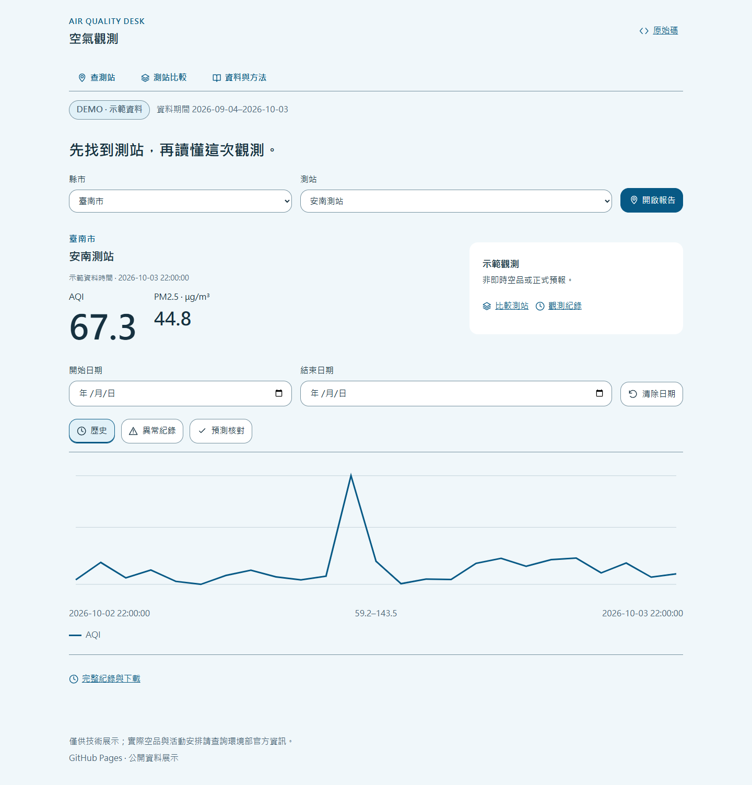
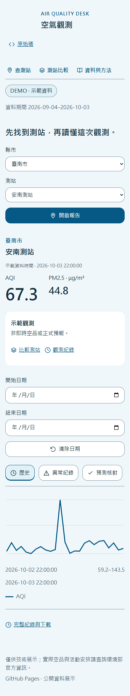

# Taiwan AQI — 空氣觀測與預測分析

[](https://github.com/Lily09-project/aqi-anomaly-dashboard/actions/workflows/quality.yml)

以 Python 建立空品資料管線、異常偵測與歷史預測驗證；公開展示版以測站觀測報告為核心。

[開啟互動展示網站](https://lily09-project.github.io/aqi-anomaly-dashboard/) · 不需登入，也不需作者的裝置開機。

## 展示版重點

- 選擇縣市與測站，查看最新示範 AQI、PM2.5 及歷史趨勢。
- 在同一測站查看異常紀錄與次小時預測核對；最多三站比較。
- 保留完整紀錄、排序、分頁、最多三筆紀錄比較及 CSV／JSON 匯出。

GitHub Pages 使用可重現的合成資料，不是即時監測、正式預報或健康建議。Python／Streamlit 另提供完整分析流程。

## 介面




## 本機啟動

需求：Python 3.12；Windows 可使用專案啟動器。

```powershell
git clone https://github.com/Lily09-project/aqi-anomaly-dashboard.git
cd aqi-anomaly-dashboard
.\run_project.bat
```

## 測試與安全

```powershell
python -m pytest -q
```

CI 執行品質、安全與 Pages 瀏覽器驗收。公開展示只發布經允許的靜態檔案與欄位；金鑰、個人資料和本機暫存不應提交。SHA-256 用於內容完整性核對，不代表來源身分認證。

部署與功能邊界見 [GitHub Pages 指南](docs/GITHUB_PAGES.md)，安全通報見 [SECURITY.md](SECURITY.md)。
